# Terrengmodell i desktop GIS

Vi skal lage en 3D visualisering av terrengmodell i desktop GIS. Det finnes en rekke avanserte GIS platforme til desktop. Tidligere har ESRI dominert markedet med [ArcGIS](http://www.esri.com/software/arcgis) - [MapInfo](http://www.mapinfo.com/) er også stor. Etterhvert har Open Source alternativene vokst seg store - blant de mest populære er [Quantum GIS / QGIS](http://www.qgis.org/en) og [GRASS GIS](http://grass.osgeo.org/).

Du kan hente [filene til denne veiledning på github](https://github.com/GeoForum/veiledning03) - eller du kan bygge strukturen opp selv.

Se dette eksemplet <a href="http://geoforum.github.io/veiledning03/" target="_blank">live demo på github pages</a>. Følge evt [denne instruks](testserver.md) hvis du vil sette opp lokal test-server.

## QGIS og data
Gå til http://www.qgis.org/en/site/forusers/download.html, last ned og installer QGIS. Det finnes til både Linux, Mac og Windows.

Last ned terrengmodell i fra Kartverket her:
http://data.kartverket.no/download/content/digital-terrengmodell-10-m-utm-33

For å laste ned fra Kartverket, må du først [opprette ny bruker](http://data.kartverket.no/download/user/register) og logge inn. Velg de områder du ønsker terrengmodell for og klikk på "Legg i kurv > Se kurven > Bestill > laste ned filene her > Download" og du kan nå lagre data som DEM fil (xyz text koordinater), ligger her som [qgis/data/6900_2_10m_z33.dem](qgis/data/6900_2_10m_z33.dem).


Pakk ut zip-filen og legg den til i QGIS som "raster layer". Du vil se, at QGIS ofte selv oppdager projeksjon og koordinater - i dette tilfelle EPSG:32633 - se bilde nedenfor. Hvis du ønsker kan du bruke prosjekt-filen [qgis/veiledning03a.qgs](qgis/veiledning03a.qgs) og åpne den med QGIS.

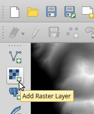 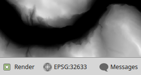

Data ligger nå i rå tekst-format som i filen [qgis/data/6900_2_10m_z33.dem](qgis/data/6900_2_10m_z33.dem). For bedre performance, er det lurt å konvertere til en binært format som fx geotiff:

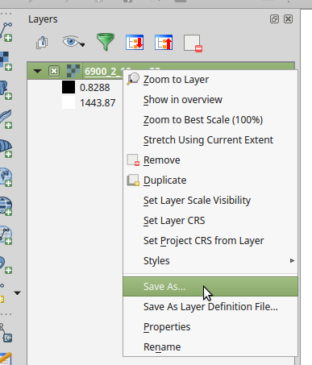 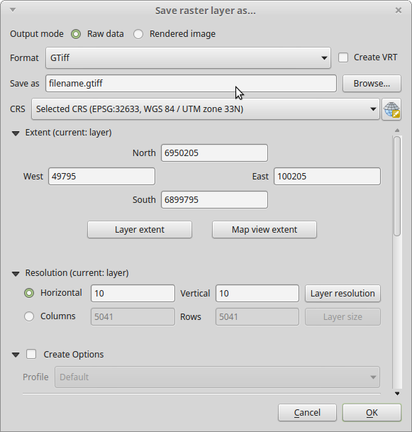

## Raster data og 2.5D

Terrengmodellen her  er raster data i motesettning til de forrige veiledninger, der vi jobbet med vektor data (som fx punkt, linje og polygon). Raster data er som et vanlig bilde - det består av rasters / pixels som kan have en eller flere verdier. I dette tilfelle er det en verdi for hver x-y-koordinat - nemlig en z-verdi (høyde). I et vanlig foto, er det tre verdier for hver koordinat - nemlig en verdi for rød, en for grønn og en for blå. Raster data kan inneholde hvor mange verdier som helst for hver koordinat - sattelit-bilder inneholder ofte opp til 20 verdier - også kallet bånd eller "bands". Å strukturere en terrengmodell på denne måten kalles 2.5D, da det reelt er et 2-dimensionellt koordinatsystem med den tredje koordinat - z-verdien - som attributt. "Ægte" 3D er et koordinatsystem med 3 dimensioner og hvor alle objekter har 3 koordinater for hvert punkt.

## Rendering

I utgangspunktet vil QGIS vise terrengmodellen i gråfarger, men det finnes naturligvis andre kule måter å vise det på. Hvis du høyreklikker på laget og velger "duplicate" vil du få fler lag som viser til samme datakilde. Det er en grei måte å teste forskjellige måter å vise samme data på - altså forskjellige typer av kartografi - også kallet "style" eller "symbology". Kartografi lagres ikke i datakilden. Utgangspunket er greyscale:

 

## Pseudocolor
En måte grei kartografisk metode til dette formålet er "pseudocolor". 

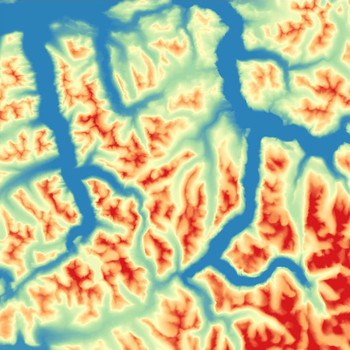 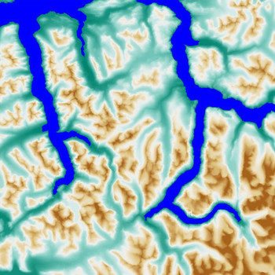

I det andre eksemple ovenfor er valgt en fargeskala fra grønt til brun fordelt på 16 intervaller fra 1-1600 meter over havet - i tillegg er en klasse lagt til manuellt med blå-farge for havet. Brukersnittet fås frem ved å høyreklikke på laget og velge "properties" og "style":

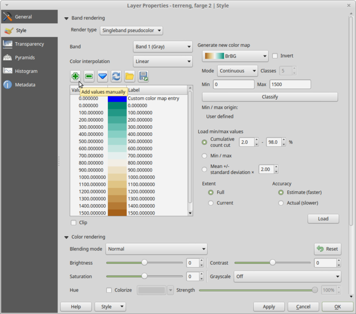

## Hillshade
En annen kul måte å vise terreng på er vha hillshade. 

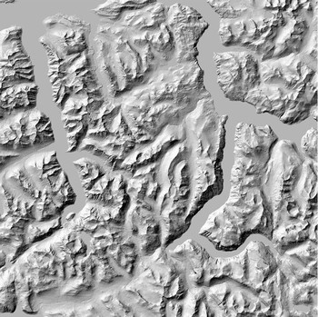 

Velg fra QGIS menyen "Raster > Analysis > DEM" og bruk Mode = Hillshade. Det lages en analyse av terrengmodellen med utgangspunkt i lyskildens posisjon og retning (azimuth og altitude) mv og output er en ny geotiff fil med data for skygge. 

 

Det ser litt rart ut at vannet er farget gråt - bruk info-tool til å inspisere bildet til å bestemme hviklen verdi haveoverflaten har. Sett deretter no-data value til den verdien - prøv evt samtidig å sette global transparancy til 50%:

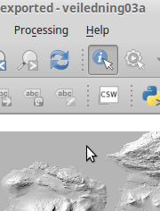 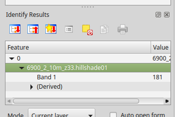

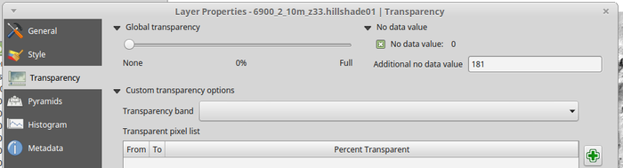

I stedet for global transparancy kan du prøve med forskjellige typer "color rendering":


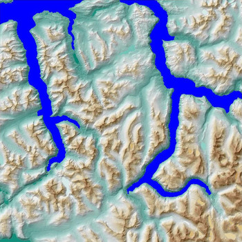 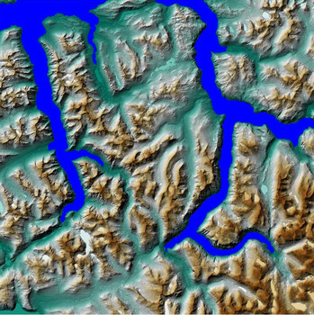 

## Slope og Aspect
Det er også mulig å analysere helningen (slope) og retning (aspect) i terregnet og vise det på kartet:

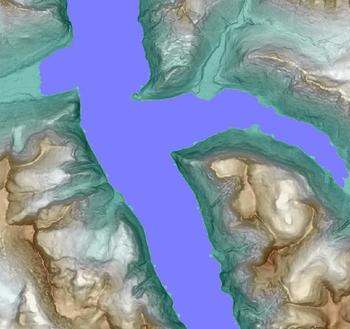 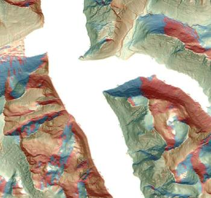

Det gjøres også under "Raster > Analysis > DEM" men med bruk av annen mode:

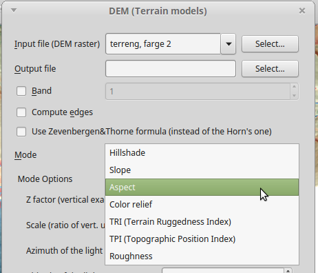 

## Raster beregning

Når man har forskjellige raster lag er det mulig å lage beregninger med dise ved å bruke verktøyet "Raster > Ŗaster Calculator":

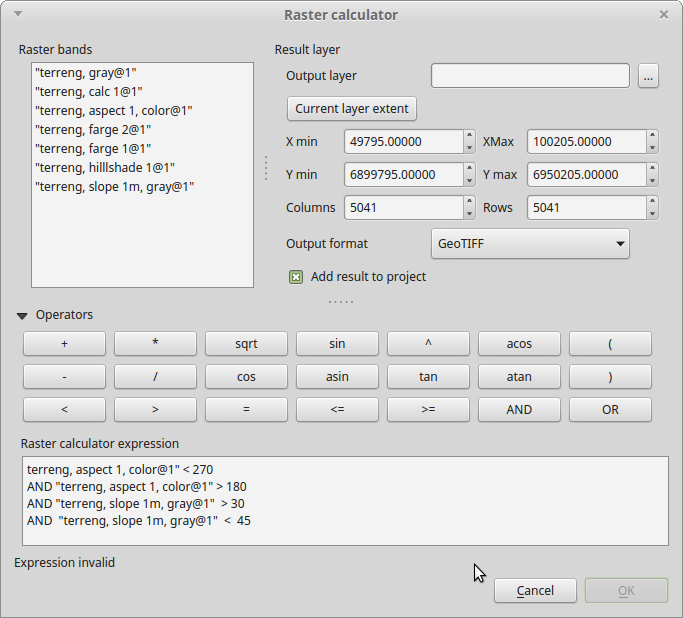 

I dette eksemplet finnes områder på kartet som har en retning mellem 180 og 270 grader (mellom syd og vest) og som har en helning mellom 30 og 45 grader:

```sql
"terreng, aspect 1, color@1" < 270  
AND "terreng, aspect 1, color@1" > 180 
AND "terreng, slope 1m, gray@1"  > 30 
AND  "terreng, slope 1m, gray@1"  <  45
```
Resultat lagres i en ny geotiff fil og ser slik ut - nye rasters vises med orange:

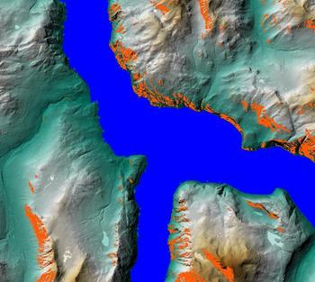 

# Data for bygninger

Det er mulig å laste ned data fra Open Street Map (OSM) her:
https://www.openstreetmap.org/export

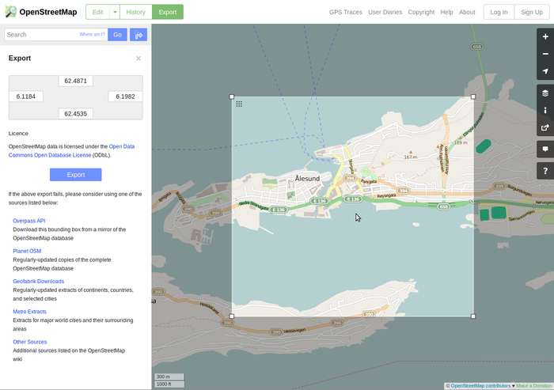 

Data kommer i osm sitt xml-format som kan legges til QGIS direkte. I dene OSM-filen er det blannet mye forskjellige objekttyper i data. Vi ønsker å sortere ut bygninger - åpen lagets attributt-tabell og klikk på "Select features using an expression" og sett sammen et passende uttrykk - fx:

```sql
"name" like '%building%'
```

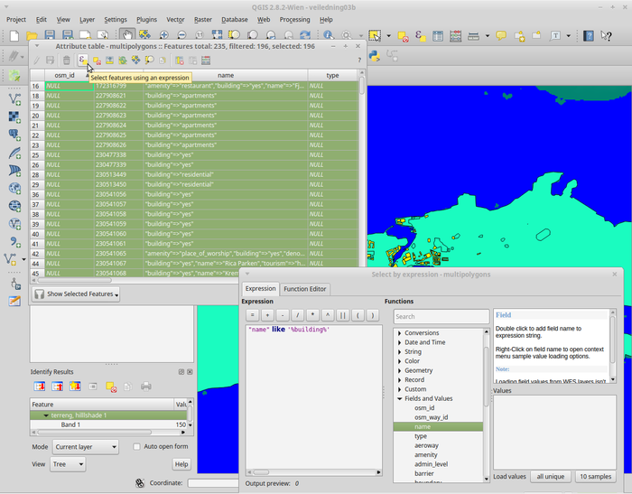 

Det er lurt å lagre bygningene i en separat fil, siden performance er mye bedre på binære formater som fx shape enn på tekst-format som xml, json mv - og når man som her bruker et filter på data forringer det også performance. Høyreklikk på laget, velg "Save as", velg "Save only selected features":

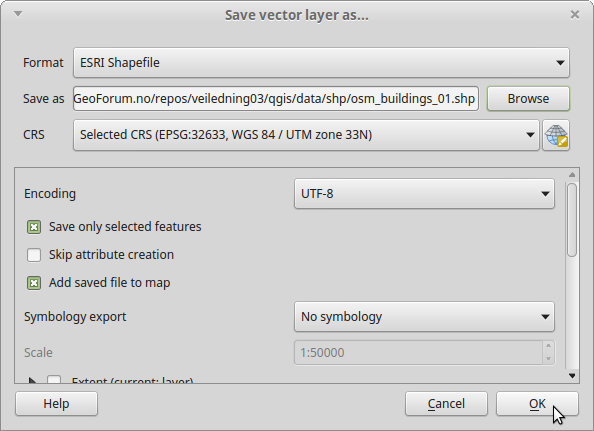 

# 3D visning

For 3D-visning trenger vi en plugin til QGIS. Åpen "Plugins > Manage and install plugins" - skriv "Qgis2ThreeJS" i søkefeltet og installer. Du kan bruke prosjekt-filen [qgis/veiledning03b.qgs](qgis/veiledning03b.qgs) eller bygge opp egen.

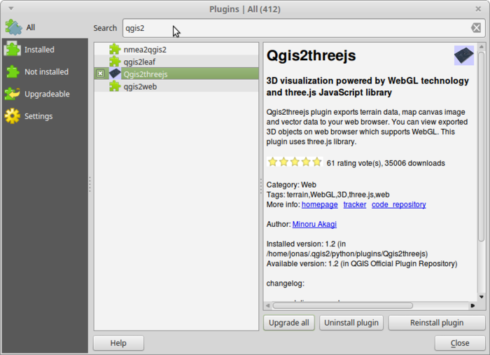 

Aktiver plugin for å vise data: "Web > Qgis2ThreeJS > Qgis2ThreeJS" - velg korrekt DEM og Polygon lag til visning, sett fast høyde (fx 20m) som bygningene skal vises med:

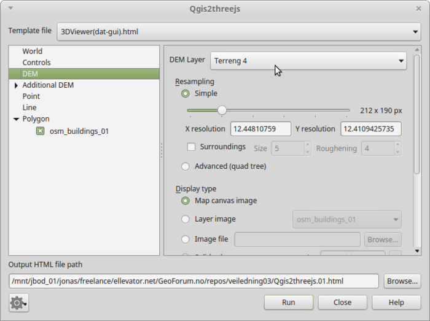 

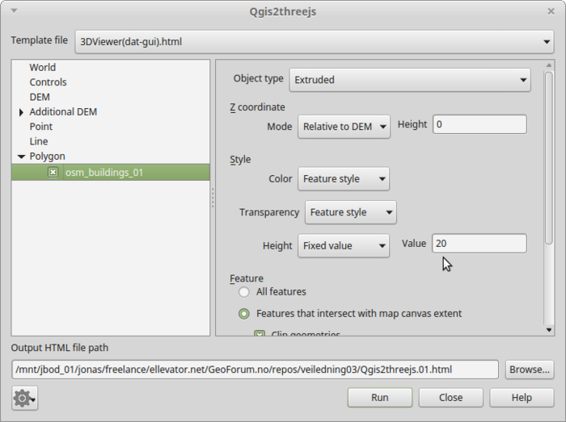 

Klikk på "run" og 3D-modellen kan vises i nettleseren:

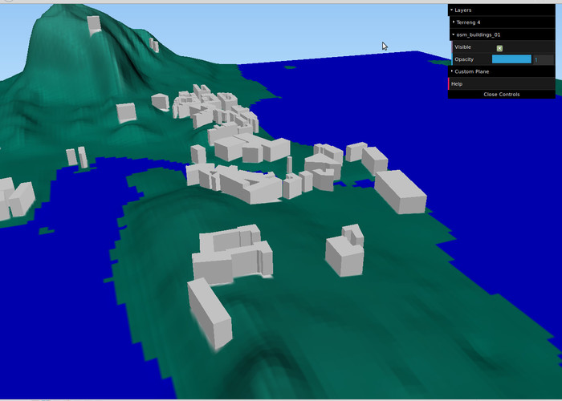 


